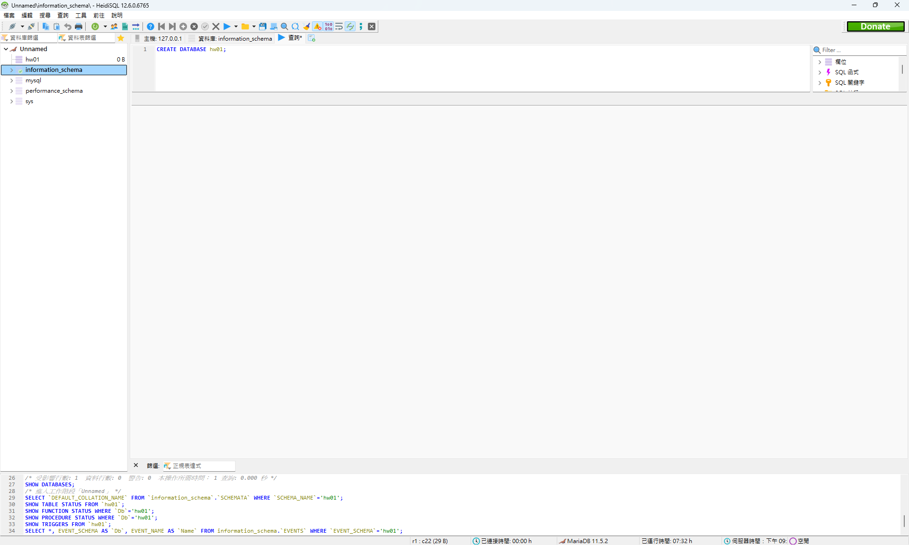
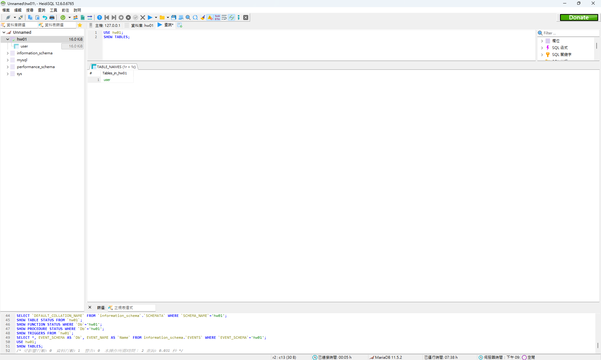
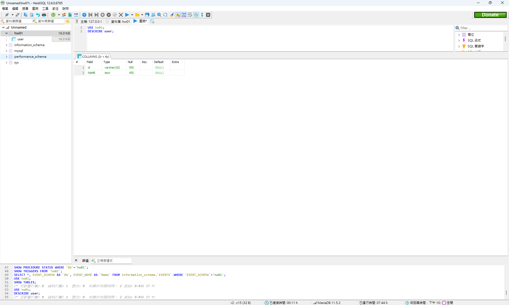

# 資料庫系統 hw1

## 資工三 111590012 林品緯

### 1.

### 2.

- Self-describing nature of a database system

  儲存數據的描述

- Insulation between programs and data

  把程式和資料分開

- Data Abstraction

  允許在不修改資料庫訪問程式的情況下，對數據結構和存儲組織進行更改

- Support of multiple views of the data

  方便對相同的資料建立不同畫面

- Sharing of data and multi-user transaction processing

  隱藏數據存儲的細節，提供一個簡單且易於理解的概念視圖

### 3.

#### (a) data model

描述資料庫的結構、操控這些結構的操作，以及資料庫應該遵守的約束。

#### (b) database schema

資料庫的描述。

包含資料庫結構、資料類型及資料庫限制的描述。

### 4.

#### three-schema architecture

是一種 DBMS 支持的架構，分為三層。

1. Internal schema

   資料如何儲存在硬體上

2. Conceptual schema

   邏輯結構，包含實體、關係等。

3. External schemas

   用戶看到的介面和資料。

#### logical data independence

在變更 conceptual schema 下不用變更 external schemas

#### physical data independence

在變更 internal schema 下不用變更 conceptual schema

### 5.

|     | Entity 1  | Cardinality Ratio | Etity 2 |
| --- | --------- | ----------------- | ------- |
| 1.  | Student   | M:N               | Book    |
| 2.  | Student   | N:1               | Advisor |
| 3.  | ClassRoom | 1:N               | Wall    |
| 4.  | Student   | M:N               | Course  |
| 5.  | Car       | N:1               | Engine  |

### 6.
