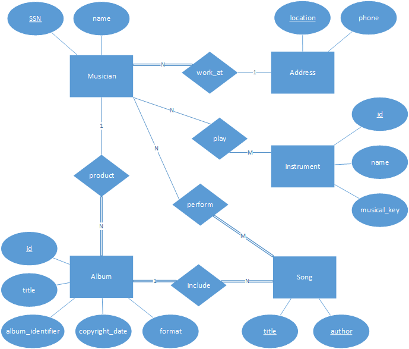
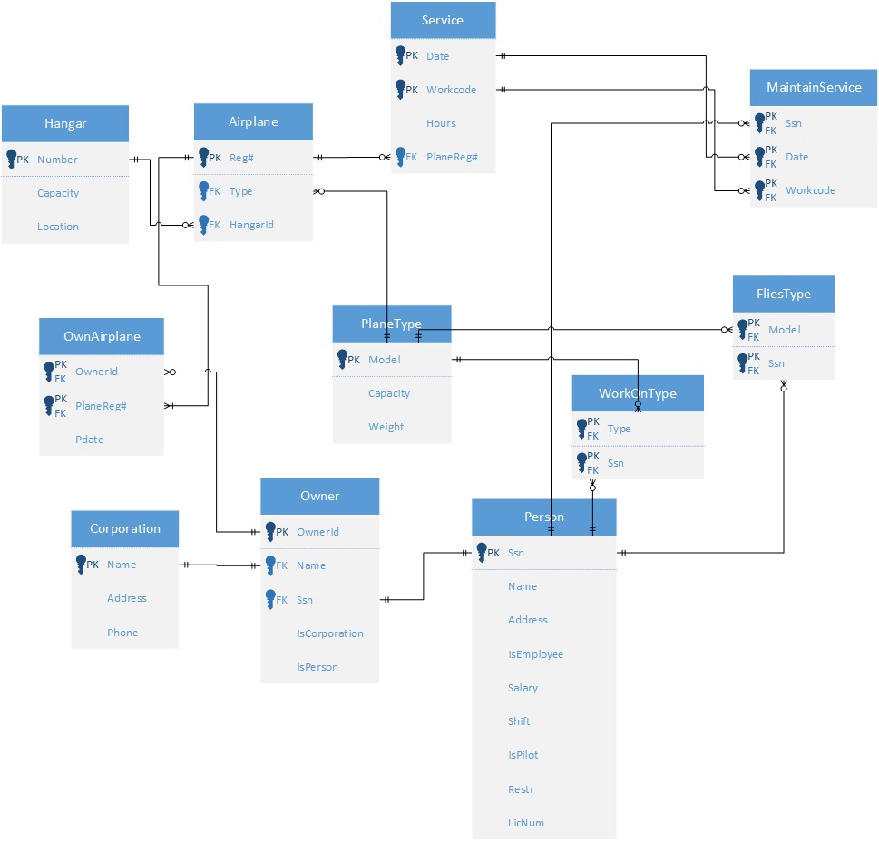

# 資料庫系統 hw2

## 資工三 111590012 林品緯

### 1.

- song 的鍵值由 title 和 author 組成
- 因為不同 musician 有相同 address，所以 address 為一個 entity 避免重複情況，並且 phone 是跟著 address 的

### 2.

#### (a)

hierarchy 只能有一個父實體。lattice 可以有多個父實體。

#### (b)

shared subclass 是全部父實體的交集，會繼承所有父實體的屬性。category 則不必繼承所有父類別的屬性。

### 3.

#### (a)

沒問題

#### (b)

違反 referential integrity，因為沒有 Dnumber 為 2 的列。需要先新增 Dnumber 為 2 的 Department，才能執行操作。

#### (c)

沒問題

#### (d)

違反 referential integrity，因為沒有 Work_on 中有 Pno 為 1 的列。需要先把 Work_on 中所有 Pno 為 1 的列修改或刪除，才能執行操作。

#### (e)

違反 referential integrity，因為沒有 Employee 中沒有 Ssn 為 943775543 的列。需要先新增 Ssn 為 943775543 的 Employee，才能執行操作。

#### (f)

違反 referential integrity，因為有 Work_on 中有 Pno 為 30 的列。需要先把 Work_on 中所有 Pno 為 30 的列修改或刪除，才能執行操作。

### 4.

