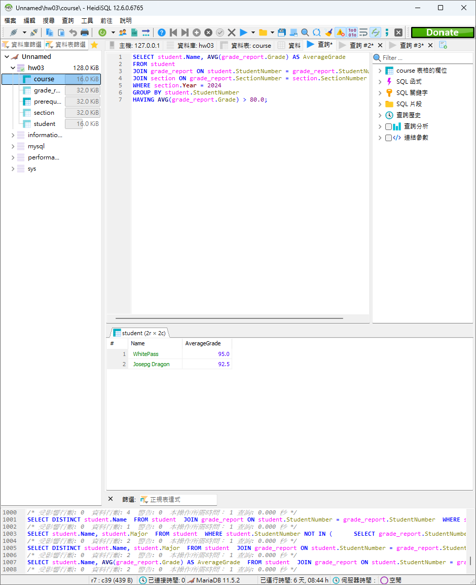
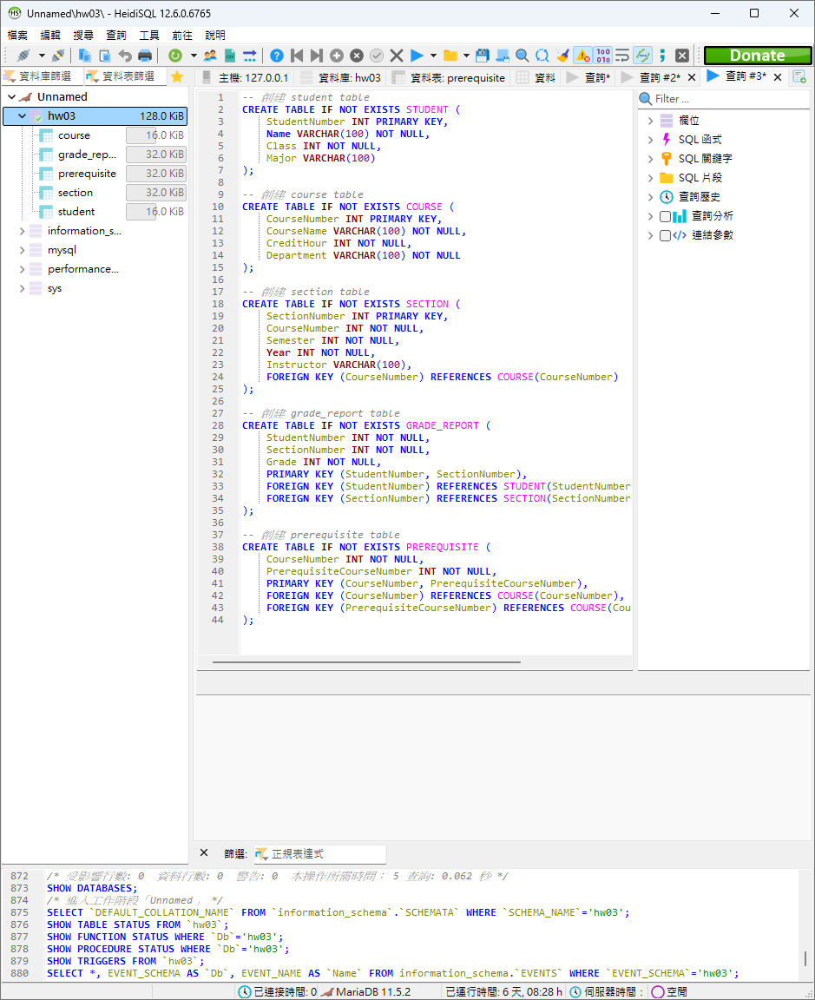

# 資料庫系統 hw3

## 資工三 111590012 林品緯

### 1.

#### (a)

```sql
UPDATE course
SET CreditHour = 3
WHERE CourseName = 'Computer Programming' AND Department = 'CSIE';
```


#### (b)

```sql
DELETE FROM student
WHERE Name = 'Edward' AND StudentNumber = '113590100';
```


#### (c)

```sql
SELECT DISTINCT course.CourseName
FROM course
JOIN section ON course.CourseNumber = section.CourseNumber
WHERE section.Instructor = 'Gupta'
  AND section.Year BETWEEN 2020 AND 2024;
```


#### (d)

```sql
SELECT section.CourseNumber,
       section.Semester,
       section.`Year`,
       COUNT(grade_report.StudentNumber) AS StudentCount
FROM section
JOIN grade_report ON section.SectionNumber = grade_report.SectionNumber
WHERE section.Instructor = 'Andy'
GROUP BY section.CourseNumber, section.Semester, section.`Year`;
```


#### (e)

```sql
SELECT course.CourseNumber, course.CourseName
FROM course
JOIN prerequisite ON prerequisite.PrerequisiteCourseNumber = course.CourseNumber
JOIN course AS course1 ON prerequisite.CourseNumber = course1.CourseNumber
WHERE course1.CourseName = 'Database Systems'
  AND course1.Department = 'CSIE';
```


#### (f)

```sql
SELECT
    student.Name,
    course.CourseNumber,
    course.CourseName,
    course.CreditHour,
    section.Semester,
    section.Year,
    grade_report.Grade
FROM student
JOIN grade_report ON student.StudentNumber = grade_report.StudentNumber
JOIN section ON grade_report.SectionNumber = section.SectionNumber
JOIN course ON section.CourseNumber = course.CourseNumber
WHERE student.Class = 3
  AND student.Major = 'CSIE';
```


#### (g)

```sql
SELECT DISTINCT student.Name
FROM student
JOIN grade_report ON student.StudentNumber = grade_report.StudentNumber
WHERE student.StudentNumber NOT IN (
    SELECT grade_report.StudentNumber
    FROM grade_report
    WHERE grade_report.Grade < 80
);
```


#### (h)

```sql
SELECT student.Name, student.Major
FROM student
WHERE student.StudentNumber NOT IN (
    SELECT grade_report.StudentNumber
    FROM grade_report
    WHERE grade_report.Grade < 60
);
```


#### (i)

```sql
SELECT DISTINCT student.Name, student.Major
FROM student
JOIN grade_report ON student.StudentNumber = grade_report.StudentNumber
WHERE grade_report.Grade < 60
ORDER BY student.StudentNumber;
```


#### (j)

```sql
SELECT student.Name, AVG(grade_report.Grade) AS AverageGrade
FROM student
JOIN grade_report ON student.StudentNumber = grade_report.StudentNumber
JOIN section ON grade_report.SectionNumber = section.SectionNumber
WHERE section.Year = 2024
GROUP BY student.StudentNumber
HAVING AVG(grade_report.Grade) > 80.0;
```



#### (k)

```sql
SELECT student.Major, COUNT(student.StudentNumber) AS NumberOfStudents
FROM student
JOIN (
    SELECT StudentNumber, AVG(grade_report.Grade) AS AverageGrade
    FROM grade_report
    GROUP BY StudentNumber
    HAVING AVG(grade_report.Grade) < 60.0
) AS subquery ON student.StudentNumber = subquery.StudentNumber
GROUP BY student.Major;
```


#### (l)

```sql
CREATE VIEW StudentCourseDetails AS
SELECT
    student.StudentNumber,
    student.Name AS StudentName,
    course.CourseName,
    section.Semester,
    section.Year,
    grade_report.Grade
FROM student
JOIN grade_report ON student.StudentNumber = grade_report.StudentNumber
JOIN section ON grade_report.SectionNumber = section.SectionNumber
JOIN course ON section.CourseNumber = course.CourseNumber;
```


### 2.

#### (a)

```sql
-- 創建 student table
CREATE TABLE IF NOT EXISTS STUDENT (
    StudentNumber VARCHAR(9) PRIMARY KEY,
    Name VARCHAR(100) NOT NULL,
    Class INT NOT NULL,
    Major VARCHAR(100)
);

-- 創建 course table
CREATE TABLE IF NOT EXISTS COURSE (
    CourseNumber INT PRIMARY KEY,
    CourseName VARCHAR(100) NOT NULL,
    CreditHour INT NOT NULL,
    Department VARCHAR(100) NOT NULL
);

-- 創建 section table
CREATE TABLE IF NOT EXISTS SECTION (
    SectionNumber INT PRIMARY KEY,
    CourseNumber INT NOT NULL,
    Semester INT NOT NULL,
    Year INT NOT NULL,
    Instructor VARCHAR(100),
    FOREIGN KEY (CourseNumber) REFERENCES COURSE(CourseNumber)
);

-- 創建 grade_report table
CREATE TABLE IF NOT EXISTS GRADE_REPORT (
    StudentNumber VARCHAR(10) NOT NULL,
    SectionNumber INT NOT NULL,
    Grade INT NOT NULL,
    PRIMARY KEY (StudentNumber, SectionNumber),
    FOREIGN KEY (StudentNumber) REFERENCES STUDENT(StudentNumber) ON DELETE CASCADE,
    FOREIGN KEY (SectionNumber) REFERENCES SECTION(SectionNumber)
);

-- 創建 prerequisite table
CREATE TABLE IF NOT EXISTS PREREQUISITE (
    CourseNumber INT NOT NULL,
    PrerequisiteCourseNumber INT NOT NULL,
    PRIMARY KEY (CourseNumber, PrerequisiteCourseNumber),
    FOREIGN KEY (CourseNumber) REFERENCES COURSE(CourseNumber),
    FOREIGN KEY (PrerequisiteCourseNumber) REFERENCES COURSE(CourseNumber)
);
```



#### (b)

```sql
-- 填充 student table
INSERT INTO STUDENT (StudentNumber, Name, Class, Major)
VALUES
('113590011', 'WhitePass', 3, 'CSIE'),
('113590012', 'Josepg Dragon', 3, 'CSIE'),
('113590013', 'Chill guy', 3, 'CSIE'),
('113590099', 'Huh', 3, 'Electrical Engineering'),
('113590100', 'Edward', 3, 'Electrical Engineering');

-- 填充 course table
INSERT INTO COURSE (CourseNumber, CourseName, CreditHour, Department)
VALUES
(1, 'Introduction to Programming', 3, 'CSIE'),
(2, 'Mechanics', 4, 'CSIE'),
(3, 'Circuit Analysis', 3, 'CSIE'),
(4, 'Computer Programming', 2, 'CSIE'),
(5, 'Linear Algebra', 3, 'CSIE'),
(6, 'Database Systems', 3, 'CSIE');

-- 填充 section table
INSERT INTO SECTION (SectionNumber, CourseNumber, Semester, Year, Instructor)
VALUES
(1, 1, 1, 2020, 'Gupta'),
(2, 2, 2, 2020, 'Gupta'),
(3, 1, 1, 2021, 'Gupta'),
(4, 2, 2, 2021, 'Andy'),
(5, 1, 1, 2022, 'Gupta'),
(6, 2, 2, 2022, 'Andy'),
(7, 1, 1, 2023, 'Andy'),
(8, 2, 2, 2023, 'Andy'),
(9, 4, 1, 2024, 'jykuo'),
(10, 3, 2, 2024, 'Andy');

-- 填充 grade_report table
INSERT INTO GRADE_REPORT (StudentNumber, SectionNumber, Grade)
VALUES
('113590011', 1, 90),
('113590012', 1, 90),
('113590013', 1, 60),
('113590100', 1, 60),
('113590099', 1, 80),
('113590011', 2, 80),
('113590012', 2, 70),
('113590013', 2, 40),
('113590100', 2, 55),
('113590099', 2, 60),
('113590013', 4, 60),
('113590100', 4, 60),
('113590011', 9, 90),
('113590012', 9, 85),
('113590013', 9, 60),
('113590100', 9, 60),
('113590099', 9, 61),
('113590011', 10, 100),
('113590012', 10, 100),
('113590013', 10, 60),
('113590100', 10, 60),
('113590099', 10, 50);

-- 填充 prerequisite table
INSERT INTO PREREQUISITE (CourseNumber, PrerequisiteCourseNumber)
VALUES
(2, 1),
(6, 5),
(6, 4);
```


#### (c)

放在第一大題

#### (d)

```sql
DELIMITER $$

CREATE PROCEDURE if NOT exists GetStudentCourses(
    IN p_StudentNumber INT,
    IN p_Semester INT,
    IN p_Year INT
)
BEGIN
    SELECT
        course.CourseNumber,
        course.CourseName,
        section.Instructor,
        grade_report.Grade
    FROM section
    JOIN course ON section.CourseNumber = course.CourseNumber
    LEFT JOIN grade_report ON section.SectionNumber = grade_report.SectionNumber
                             AND grade_report.StudentNumber = p_StudentNumber
    WHERE section.Semester = p_Semester
      AND section.Year = p_Year
      AND grade_report.StudentNumber = p_StudentNumber;
END $$

DELIMITER ;
```


